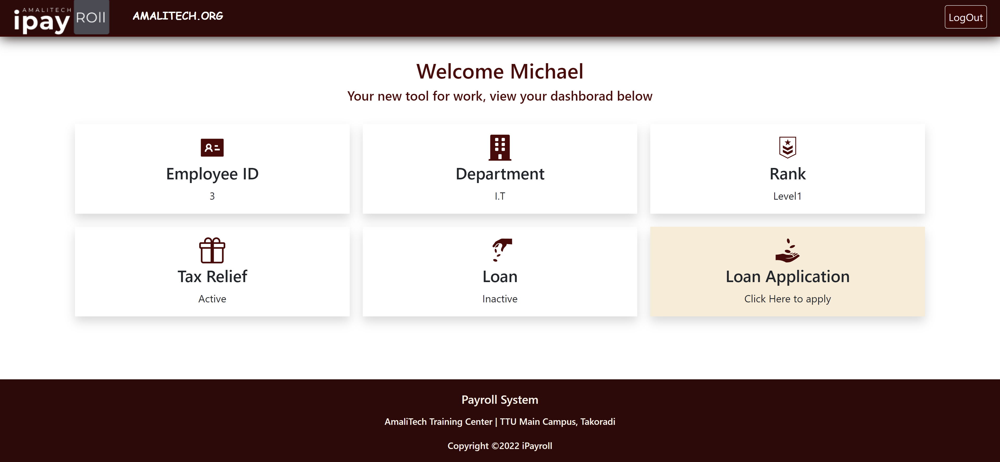

# iPayroll

A Payroll Management System.

## Table of contents

* [General info](#general-info)
* [Screenshot](#screenshot)
* [Technologies](#technologies)
* [Languages](#languages)
* [Features](#features)
* [Inspiration](#inspiration)
* [Developers](#developers)

## General info

A web application that seeks to simplify the tasks related to payroll management. All calculations are based on the official procedure used by [SSNIT](https://www.ssnit.org.gh/) and [GRA](https://gra.gov.gh/)

## Screenshot

## Technologies

* Node and Node Package Manager
* Git & GitHub
* Express
* Postgres
* HTML
* CSS
* React

## Languages

* JavaScript

## Features

The GUI entails two forms, an employee UI and an administrator UI.
The Employee UI allows users to:
* View their records
* Apply for Loans
The Admin UI allows users to:
* Manage Rates. This denotes the salaries, cash allowances and deductions for a particular Rank.
* Manage Employees.
* Manage Wages. This includes generating monthly payslips and sending to employees via mail.
* Manage Loans. This includes accepting with deduction rates, and declining loans applied by employees.
* Manage Tax Reliefs.
* Download Reports on each table in xlsx(excel) format.
The API also contains endpoints that returns filing data for ssnit and gra for a given month.
Refer to the Swagger docs for more info on the API.

## Status

First release.

## Inspiration

This was a capstone project that climaxed the graduate trainee program by Amalitech Ghana. It was a challenge that we faced with excitement, as this was a huge opportunity to put what we had learned during the program into practice. The thrill of building a whole system from scratch also served as a great form of motivation.

## Developers

[Michael Hagan](https://github.com/amalitechmichaelhagan)

[Francis Coffie](https://github.com/francis.coffie@amalitech.org)
